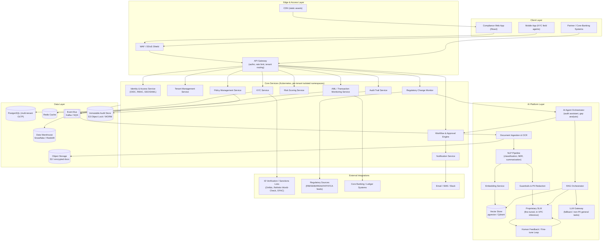

# 1. System Architecture

## 1.1 High-level diagram

## 1.2 Layer-by-layer breakdown

### Client layer
- **Compliance Web App** — the primary surface for compliance officers, MLROs (Money Laundering Reporting Officers), risk analysts, and auditors. React SPA served via CDN.
- **Mobile app** — used by field KYC agents for document capture (liveness check, ID scan) in low-connectivity environments; syncs offline queue to the API when reconnected.
- **Partner / core-banking integration** — inbound webhooks and outbound SDKs so a bank's core banking or loan origination system can call Aegis synchronously during onboarding.

### Edge & access layer
- **WAF/DDoS shield** — OWASP top-10 + bot mitigation in front of everything; mandatory for a system holding financial PII.
- **API Gateway** — single entry point doing JWT/OIDC validation, per-tenant rate limiting, request signing verification for partner integrations, and routing by tenant + service. Also the enforcement point for API versioning and canary routing.

### Core services layer
Deployed as independently scalable microservices (see [Tech Stack](04-tech-stack.md)), each tenant-namespaced with row-level security backing shared services, or fully isolated for silo tenants (see [Deployment Architecture](08-deployment-architecture.md)).

- **Identity & Access** — OIDC/SAML SSO, MFA, RBAC/ABAC policy evaluation (see [Security](11-security-compliance.md)).
- **Tenant Management** — tenant provisioning, subscription tier, feature flags, data-residency configuration.
- **KYC Service** — customer onboarding, document capture, identity verification orchestration, PEP/sanctions screening triggers.
- **AML / Transaction Monitoring** — rule-based + ML-scored transaction surveillance, alert generation, case management.
- **Risk Scoring Service** — composite customer/entity risk score combining KYC risk, transaction behavior, geography, and AI-derived signals.
- **Policy Management** — versioned repository of internal policies mapped to regulatory clauses; drives gap analysis.
- **Workflow & Approval Engine** — configurable state machines (BPMN-like) for onboarding approval, alert disposition, policy sign-off, audit response — every AI recommendation terminates in a human approval step here.
- **Audit Trail Service** — writes an immutable, cryptographically hash-chained record of every state change and AI inference to the WORM store.
- **Regulatory Change Monitor** — polls/subscribes to regulator feeds and diffs them against the tenant's policy library, raising gap-analysis tasks.
- **Notification Service** — email/SMS/Slack/Teams/webhook fan-out for approvals, SLA breaches, and alerts.

### AI platform layer
See [AI Pipeline](03-ai-pipeline.md) and [SLM + RAG Architecture](07-slm-rag-architecture.md) for full depth. In summary: documents are ingested, OCR'd, classified, chunked, embedded, and indexed; the RAG orchestrator retrieves grounded context; the proprietary SLM (in-VPC, never sees data outside the tenant boundary) generates drafts, summaries, classifications, and gap analyses; a guardrails layer redacts PII before anything crosses to an external LLM gateway (used only for non-sensitive, general-purpose tasks with tenant opt-in); everything routes through human review before becoming a system-of-record fact.

### Data layer
- **PostgreSQL** — primary OLTP store, multi-tenant with row-level security (RLS).
- **Object storage (S3-compatible)** — encrypted document store (KYC documents, policy PDFs, contracts).
- **Vector store** — pgvector (co-located, simpler ops, good to ~10M vectors/tenant-pool) or Qdrant (dedicated, for larger scale) — see [SLM + RAG](07-slm-rag-architecture.md).
- **Event bus (Kafka/SQS)** — decouples ingestion, async AI processing, and audit logging from the request path.
- **Data warehouse** — Snowflake/Redshift for BI, regulator reporting extracts, and model evaluation datasets.
- **Redis** — session cache, rate-limit counters, workflow state cache.
- **WORM audit store** — S3 Object Lock (compliance mode) — audit records cannot be altered or deleted, even by admins, for the tenant's configured retention period (typically 7–10 years).

### External integrations
ID verification (Onfido/Trulioo/IDnow), sanctions/PEP/adverse-media screening (Refinitiv World-Check, Dow Jones, OFAC/UN/EU lists), regulator publication feeds, core banking/ledger systems, and standard comms channels.

## 1.3 Key architectural decisions

| Decision | Rationale |
|---|---|
| Microservices over monolith | Compliance functions (KYC, AML, audit) have different scaling, latency, and regulatory isolation requirements; independent deployability reduces blast radius of changes in a regulated environment. |
| Event-driven core with sync API façade | Client-facing calls stay low-latency (sync CRUD); heavy AI/document work happens async off the event bus so a slow OCR job never blocks an onboarding API call. |
| In-VPC proprietary SLM as default inference path | Keeps customer PII from ever leaving the tenant's security boundary — the single biggest blocker to bank/insurer adoption of "AI compliance" tools. |
| Append-only audit log, separate from OLTP | Auditors and regulators need tamper-evidence; co-locating audit with mutable OLTP data undermines that guarantee. |
| Human approval as a first-class workflow object, not a UI checkbox | Every jurisdiction's regulator expects a named, accountable human decision-maker of record — this must be modeled in the data, not bolted onto the UI. |
