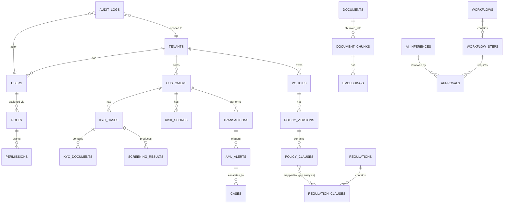

# 2. Database Schema

## 2.1 Multi-tenancy strategy

Three isolation tiers, selectable per tenant at provisioning time:

| Tier | Strategy | Used for |
|---|---|---|
| **Pool** | Shared tables, `tenant_id` column + PostgreSQL Row-Level Security (RLS) on every table | SMB/mid-market FinTechs, NBFCs |
| **Bridge** | Shared cluster, schema-per-tenant (`tenant_<id>.*`) | Growth-tier customers needing stronger logical isolation without dedicated infra cost |
| **Silo** | Dedicated database cluster + dedicated VPC | Tier-1 banks/insurers with contractual or regulatory data-residency/isolation requirements |

All tiers share the same logical schema below. RLS policy example:

```sql
ALTER TABLE customers ENABLE ROW LEVEL SECURITY;

CREATE POLICY tenant_isolation ON customers
    USING (tenant_id = current_setting('app.current_tenant')::uuid);
```

The API layer sets `app.current_tenant` via `SET LOCAL` at the start of every transaction, derived from the authenticated JWT — application code can never construct a query that crosses tenants, even by bug.

## 2.2 Entity-relationship diagram (core domains)



## 2.3 Core table DDL (representative subset)

```sql
-- ── Tenancy & Identity ─────────────────────────────────────────────
CREATE TABLE tenants (
    id                  UUID PRIMARY KEY DEFAULT gen_random_uuid(),
    name                TEXT NOT NULL,
    tier                TEXT NOT NULL CHECK (tier IN ('pool','bridge','silo')),
    region              TEXT NOT NULL,               -- data residency, e.g. 'ap-south-1'
    industry            TEXT NOT NULL CHECK (industry IN ('bank','nbfc','insurance','fintech')),
    status              TEXT NOT NULL DEFAULT 'active',
    encryption_key_id   TEXT NOT NULL,                -- tenant-scoped KMS key
    created_at          TIMESTAMPTZ NOT NULL DEFAULT now()
);

CREATE TABLE users (
    id              UUID PRIMARY KEY DEFAULT gen_random_uuid(),
    tenant_id       UUID NOT NULL REFERENCES tenants(id),
    email           CITEXT NOT NULL,
    full_name       TEXT NOT NULL,
    sso_subject     TEXT,                             -- OIDC 'sub' claim
    mfa_enabled     BOOLEAN NOT NULL DEFAULT true,
    status          TEXT NOT NULL DEFAULT 'active',
    created_at      TIMESTAMPTZ NOT NULL DEFAULT now(),
    UNIQUE (tenant_id, email)
);

CREATE TABLE roles (
    id          UUID PRIMARY KEY DEFAULT gen_random_uuid(),
    tenant_id   UUID REFERENCES tenants(id),          -- NULL = system-defined role
    name        TEXT NOT NULL,                        -- 'compliance_officer','mlro','auditor','admin'
    UNIQUE (tenant_id, name)
);

CREATE TABLE permissions (
    id          UUID PRIMARY KEY DEFAULT gen_random_uuid(),
    resource    TEXT NOT NULL,                        -- 'kyc_case','policy','ai_inference'
    action      TEXT NOT NULL                         -- 'read','write','approve','export'
);

CREATE TABLE role_permissions (
    role_id UUID REFERENCES roles(id),
    permission_id UUID REFERENCES permissions(id),
    PRIMARY KEY (role_id, permission_id)
);

CREATE TABLE user_roles (
    user_id UUID REFERENCES users(id),
    role_id UUID REFERENCES roles(id),
    PRIMARY KEY (user_id, role_id)
);

-- ── KYC ────────────────────────────────────────────────────────────
CREATE TABLE customers (
    id                  UUID PRIMARY KEY DEFAULT gen_random_uuid(),
    tenant_id           UUID NOT NULL REFERENCES tenants(id),
    external_ref        TEXT,                          -- core banking customer ID
    customer_type       TEXT NOT NULL CHECK (customer_type IN ('individual','entity')),
    pii_encrypted       BYTEA NOT NULL,                 -- envelope-encrypted name/DOB/address blob
    country             TEXT NOT NULL,
    onboarding_status   TEXT NOT NULL DEFAULT 'pending',
    created_at          TIMESTAMPTZ NOT NULL DEFAULT now()
);

CREATE TABLE kyc_cases (
    id              UUID PRIMARY KEY DEFAULT gen_random_uuid(),
    tenant_id       UUID NOT NULL REFERENCES tenants(id),
    customer_id     UUID NOT NULL REFERENCES customers(id),
    case_type       TEXT NOT NULL CHECK (case_type IN ('onboarding','periodic_review','edd','remediation')),
    status          TEXT NOT NULL DEFAULT 'in_progress',
    risk_tier       TEXT CHECK (risk_tier IN ('low','medium','high','prohibited')),
    assigned_to     UUID REFERENCES users(id),
    ai_recommendation JSONB,                            -- SLM output: {decision, confidence, citations[]}
    decided_by      UUID REFERENCES users(id),           -- human approver, NULL until approved
    decided_at      TIMESTAMPTZ,
    created_at      TIMESTAMPTZ NOT NULL DEFAULT now()
);

CREATE TABLE kyc_documents (
    id              UUID PRIMARY KEY DEFAULT gen_random_uuid(),
    kyc_case_id     UUID NOT NULL REFERENCES kyc_cases(id),
    doc_type        TEXT NOT NULL,                       -- 'passport','utility_bill','incorporation_cert'
    storage_uri     TEXT NOT NULL,                        -- s3://... (encrypted at rest)
    ocr_text        TEXT,
    classification  TEXT,                                 -- AI-classified doc type
    extracted_fields JSONB,                                -- NER-extracted structured fields
    verified        BOOLEAN NOT NULL DEFAULT false,
    uploaded_at     TIMESTAMPTZ NOT NULL DEFAULT now()
);

CREATE TABLE screening_results (
    id              UUID PRIMARY KEY DEFAULT gen_random_uuid(),
    kyc_case_id     UUID NOT NULL REFERENCES kyc_cases(id),
    screen_type     TEXT NOT NULL CHECK (screen_type IN ('sanctions','pep','adverse_media')),
    provider        TEXT NOT NULL,                        -- 'refinitiv','dowjones'
    match_score     NUMERIC,
    raw_response    JSONB,
    disposition     TEXT CHECK (disposition IN ('true_match','false_positive','pending_review')),
    created_at      TIMESTAMPTZ NOT NULL DEFAULT now()
);

-- ── AML / Transaction Monitoring ─────────────────────────────────────
CREATE TABLE transactions (
    id              UUID PRIMARY KEY DEFAULT gen_random_uuid(),
    tenant_id       UUID NOT NULL REFERENCES tenants(id),
    customer_id     UUID NOT NULL REFERENCES customers(id),
    amount          NUMERIC(18,2) NOT NULL,
    currency        TEXT NOT NULL,
    counterparty    JSONB,
    channel         TEXT,
    occurred_at     TIMESTAMPTZ NOT NULL,
    ingested_at     TIMESTAMPTZ NOT NULL DEFAULT now()
) PARTITION BY RANGE (occurred_at);

CREATE TABLE aml_alerts (
    id              UUID PRIMARY KEY DEFAULT gen_random_uuid(),
    tenant_id       UUID NOT NULL REFERENCES tenants(id),
    customer_id     UUID NOT NULL REFERENCES customers(id),
    transaction_id  UUID REFERENCES transactions(id),
    rule_id         TEXT,                                  -- triggering rule/model
    ai_risk_score   NUMERIC,
    severity        TEXT CHECK (severity IN ('low','medium','high','critical')),
    status          TEXT NOT NULL DEFAULT 'open',
    sar_filed       BOOLEAN NOT NULL DEFAULT false,
    disposed_by     UUID REFERENCES users(id),
    disposed_at     TIMESTAMPTZ,
    created_at      TIMESTAMPTZ NOT NULL DEFAULT now()
);

CREATE TABLE risk_scores (
    id              UUID PRIMARY KEY DEFAULT gen_random_uuid(),
    customer_id     UUID NOT NULL REFERENCES customers(id),
    score           NUMERIC NOT NULL,
    components      JSONB NOT NULL,                        -- {kyc_risk, geo_risk, behavior_risk, ai_signal}
    model_version   TEXT NOT NULL,
    computed_at     TIMESTAMPTZ NOT NULL DEFAULT now()
);

-- ── Policy & Regulatory Intelligence ─────────────────────────────────
CREATE TABLE regulations (
    id              UUID PRIMARY KEY DEFAULT gen_random_uuid(),
    jurisdiction    TEXT NOT NULL,                         -- 'IN-RBI','US-FINCEN','EU-GDPR'
    title           TEXT NOT NULL,
    source_url      TEXT,
    effective_date  DATE
);

CREATE TABLE regulation_clauses (
    id              UUID PRIMARY KEY DEFAULT gen_random_uuid(),
    regulation_id   UUID NOT NULL REFERENCES regulations(id),
    clause_ref      TEXT NOT NULL,                          -- 'Master Direction Sec 4.2'
    text            TEXT NOT NULL,
    embedding       VECTOR(1024)                             -- pgvector
);

CREATE TABLE policies (
    id              UUID PRIMARY KEY DEFAULT gen_random_uuid(),
    tenant_id       UUID NOT NULL REFERENCES tenants(id),
    name            TEXT NOT NULL,
    owner_id        UUID REFERENCES users(id),
    status          TEXT NOT NULL DEFAULT 'draft'
);

CREATE TABLE policy_versions (
    id              UUID PRIMARY KEY DEFAULT gen_random_uuid(),
    policy_id       UUID NOT NULL REFERENCES policies(id),
    version_no      INT NOT NULL,
    document_uri    TEXT NOT NULL,
    approved_by     UUID REFERENCES users(id),
    approved_at     TIMESTAMPTZ,
    created_at      TIMESTAMPTZ NOT NULL DEFAULT now()
);

CREATE TABLE policy_clauses (
    id                  UUID PRIMARY KEY DEFAULT gen_random_uuid(),
    policy_version_id  UUID NOT NULL REFERENCES policy_versions(id),
    clause_ref          TEXT,
    text                TEXT NOT NULL,
    embedding            VECTOR(1024)
);

CREATE TABLE gap_analyses (
    id                      UUID PRIMARY KEY DEFAULT gen_random_uuid(),
    tenant_id               UUID NOT NULL REFERENCES tenants(id),
    regulation_clause_id    UUID NOT NULL REFERENCES regulation_clauses(id),
    policy_clause_id        UUID REFERENCES policy_clauses(id),     -- NULL = no matching policy found
    coverage_status         TEXT CHECK (coverage_status IN ('covered','partial','missing','outdated')),
    ai_similarity_score     NUMERIC,
    ai_explanation          TEXT,
    reviewed_by             UUID REFERENCES users(id),
    reviewed_at             TIMESTAMPTZ,
    created_at              TIMESTAMPTZ NOT NULL DEFAULT now()
);

-- ── Document / RAG substrate ──────────────────────────────────────────
CREATE TABLE documents (
    id              UUID PRIMARY KEY DEFAULT gen_random_uuid(),
    tenant_id       UUID NOT NULL REFERENCES tenants(id),
    source_type     TEXT NOT NULL,                          -- 'policy','regulation','kyc_doc','audit_evidence'
    storage_uri     TEXT NOT NULL,
    classification  TEXT,
    summary         TEXT,
    created_at      TIMESTAMPTZ NOT NULL DEFAULT now()
);

CREATE TABLE document_chunks (
    id              UUID PRIMARY KEY DEFAULT gen_random_uuid(),
    document_id     UUID NOT NULL REFERENCES documents(id),
    chunk_index     INT NOT NULL,
    text            TEXT NOT NULL,
    embedding       VECTOR(1024),
    token_count     INT
);
CREATE INDEX ON document_chunks USING hnsw (embedding vector_cosine_ops);

-- ── Workflow & Approvals ───────────────────────────────────────────────
CREATE TABLE workflows (
    id              UUID PRIMARY KEY DEFAULT gen_random_uuid(),
    tenant_id       UUID NOT NULL REFERENCES tenants(id),
    entity_type     TEXT NOT NULL,                          -- 'kyc_case','aml_alert','policy_version'
    entity_id       UUID NOT NULL,
    definition_id   TEXT NOT NULL,                          -- BPMN template ref
    status          TEXT NOT NULL DEFAULT 'active',
    created_at      TIMESTAMPTZ NOT NULL DEFAULT now()
);

CREATE TABLE workflow_steps (
    id              UUID PRIMARY KEY DEFAULT gen_random_uuid(),
    workflow_id     UUID NOT NULL REFERENCES workflows(id),
    step_name       TEXT NOT NULL,
    step_order      INT NOT NULL,
    status          TEXT NOT NULL DEFAULT 'pending',
    assignee_id     UUID REFERENCES users(id),
    sla_due_at      TIMESTAMPTZ
);

CREATE TABLE ai_inferences (
    id              UUID PRIMARY KEY DEFAULT gen_random_uuid(),
    tenant_id       UUID NOT NULL REFERENCES tenants(id),
    model_name      TEXT NOT NULL,                          -- 'aegis-slm-7b-v3.2'
    task_type       TEXT NOT NULL,                          -- 'kyc_risk','doc_classify','gap_analysis','audit_qa'
    input_ref       JSONB NOT NULL,
    output          JSONB NOT NULL,
    citations       JSONB,                                   -- [{chunk_id, document_id, score}]
    confidence      NUMERIC,
    latency_ms      INT,
    created_at      TIMESTAMPTZ NOT NULL DEFAULT now()
);

CREATE TABLE approvals (
    id              UUID PRIMARY KEY DEFAULT gen_random_uuid(),
    workflow_step_id UUID NOT NULL REFERENCES workflow_steps(id),
    ai_inference_id  UUID REFERENCES ai_inferences(id),
    approver_id      UUID NOT NULL REFERENCES users(id),
    decision         TEXT NOT NULL CHECK (decision IN ('approved','rejected','escalated','modified')),
    rationale        TEXT,
    decided_at       TIMESTAMPTZ NOT NULL DEFAULT now()
);

-- ── Audit (append-only, mirrored to WORM object storage) ──────────────
CREATE TABLE audit_logs (
    id              BIGSERIAL PRIMARY KEY,
    tenant_id       UUID NOT NULL,
    actor_id        UUID,                                     -- NULL for system/AI actor
    actor_type      TEXT NOT NULL CHECK (actor_type IN ('human','ai','system')),
    action          TEXT NOT NULL,
    resource_type   TEXT NOT NULL,
    resource_id     UUID,
    before_state    JSONB,
    after_state     JSONB,
    prev_hash       TEXT NOT NULL,                            -- hash-chain for tamper evidence
    record_hash     TEXT NOT NULL,
    created_at      TIMESTAMPTZ NOT NULL DEFAULT now()
);
-- audit_logs: INSERT-only role; no UPDATE/DELETE grants exist for any application role.
```

## 2.4 Notes on PII handling

- `customers.pii_encrypted` uses envelope encryption: a per-tenant Data Encryption Key (DEK) wraps the PII blob, and the DEK itself is wrapped by a tenant-scoped KMS Customer Master Key (CMK). Rotating a tenant's CMK re-wraps DEKs without touching row data.
- Structured PII needed for search (e.g., name matching for sanctions screening) is stored separately in a tokenized/hashed lookup table, never in plaintext indexes.
- `document_chunks.text` for KYC documents is redacted (PII replaced with typed placeholders, see [SLM+RAG §4](07-slm-rag-architecture.md)) before embedding, so vector search never surfaces raw PII to the LLM/SLM context window unless explicitly re-hydrated inside the tenant's own VPC boundary at generation time.
