# 3. AI Pipeline

## 3.1 End-to-end pipeline diagram

```mermaid
flowchart LR
    A["Document / Data Ingestion<br/>(upload, email, API, crawler)"] --> B["Pre-processing<br/>OCR + layout parsing"]
    B --> C["PII Detection & Redaction"]
    C --> D["Document Classification<br/>(policy / regulation / KYC doc / contract / filing)"]
    D --> E["NLP Extraction<br/>NER, clause segmentation, key-value extraction"]
    E --> F["Chunking & Embedding"]
    F --> G[("Vector Index")]
    E --> H["Summarization"]
    G --> I["RAG Retrieval<br/>(hybrid: BM25 + vector + rerank)"]
    I --> J["SLM Generation<br/>(grounded, cited)"]
    H --> J
    J --> K["Guardrails<br/>(hallucination check, policy filter, PII leak check)"]
    K --> L["Confidence Scoring"]
    L -->|"high confidence, low-risk task"| M["Auto-apply<br/>(e.g. doc tagging)"]
    L -->|"regulatory / financial impact"| N["Human Review Queue"]
    N --> O["Compliance Officer Decision"]
    O -->|approve| P["Commit to System of Record"]
    O -->|reject/edit| Q["Feedback Store"]
    Q --> R["Fine-tuning Dataset<br/>(RLHF / DPO curation)"]
    R --> S["Periodic SLM Fine-tune Job"]
    S -.->|new model version| J
    P --> T["Audit Log (immutable)"]
    M --> T
```

## 3.2 Stage detail

### Stage 1 — Ingestion
Sources: manual upload, email-to-case, API push from core banking, scheduled crawl of regulator publication pages (RBI notifications, SEBI circulars, IRDAI guidelines, FATF updates, Federal Register). Every ingested item gets a `documents` row and lands in the event bus (`document.ingested`) for async processing — the ingesting API call returns immediately with a tracking ID.

### Stage 2 — Pre-processing (OCR + layout parsing)
- Scanned/image documents → OCR (DocTR / Tesseract fallback, cloud Textract/Document AI for complex layouts) preserving bounding boxes.
- Native PDFs/DOCX → structural parser (layout-aware, table-aware) so clause numbering and tabular data (e.g., interest rate schedules) survive extraction.
- Output: a normalized text + layout JSON regardless of source format.

### Stage 3 — PII detection & redaction
A dedicated NER pass (regex + fine-tuned token classifier) tags PII spans (names, IDs, account numbers, addresses) and replaces them with typed placeholders (`[PERSON_1]`, `[ACCOUNT_NO]`) in the text used for embedding and any path that could reach an external model. The mapping from placeholder → original value is stored separately, encrypted, and only re-hydrated inside the tenant VPC at the point of final human-facing display — never inside a prompt sent to a third-party LLM.

### Stage 4 — Document classification
Multi-label classifier (fine-tuned SLM head) tags each document: type (policy / regulatory circular / KYC ID doc / contract / SAR filing / audit evidence), jurisdiction, business line, and — for regulatory sources — obligation type (disclosure, capital, reporting, conduct). Drives routing: a regulatory circular triggers the gap-analysis pipeline; a KYC ID document triggers extraction + verification.

### Stage 5 — NLP extraction
- **NER**: entities relevant to compliance — counterparties, monetary amounts, dates, jurisdictions, regulatory clause references, legal entities.
- **Clause segmentation**: regulations and policies are split into addressable clauses (not just fixed-size chunks) so gap analysis can map clause-to-clause, not just semantically-nearby text.
- **Key-value extraction**: structured fields off KYC documents (DOB, ID number, expiry, address) via a layout-aware extraction model (LayoutLMv3-class).

### Stage 6 — Chunking & embedding
Clause-aware chunking (respect clause/section boundaries first, fall back to ~400-token sliding windows with 15% overlap for prose-heavy text) → embedding model (see [§12](12-open-source-slm-models.md)) → written to `document_chunks.embedding` (pgvector HNSW index) plus a parallel BM25 (OpenSearch) index for hybrid retrieval.

### Stage 7 — Summarization
Long-form regulatory circulars and policy documents get an abstractive summary (SLM, extractive-first prompting to reduce hallucination risk) plus a structured "what changed" diff when the source is a revision of a previously ingested document — this feeds the Regulatory Change Monitor directly.

### Stage 8 — RAG retrieval
Hybrid retrieval (dense + sparse) over the tenant's own policy corpus and the shared, curated regulation corpus, cross-encoder reranking, then citation-linked context assembly. Full detail in [SLM + RAG Architecture](07-slm-rag-architecture.md).

### Stage 9 — SLM generation
The proprietary SLM generates the task output — a KYC risk recommendation, a policy gap explanation, an audit-question answer, a document summary — always with inline citations back to `document_chunks`/`regulation_clauses` IDs so the UI can show source text side-by-side with the AI answer.

### Stage 10 — Guardrails
- **Grounding check**: does the generated answer's claims actually appear in the retrieved context (NLI-based entailment check)? Ungrounded claims are stripped or the response is downgraded to "insufficient evidence."
- **Policy filter**: blocklist/allowlist for prohibited outputs (e.g., the model must never itself declare a SAR "not required" — that determination is always routed to a human).
- **PII leak check**: output scanned to ensure no redacted PII placeholder was resolved incorrectly.

### Stage 11 — Confidence scoring & routing
Each inference gets a calibrated confidence score. Low-risk, high-confidence tasks (e.g., tagging a document's type) can auto-apply. Anything touching customer status, risk tier, SAR/CTR filing, or policy sign-off is **always** routed to human review regardless of confidence — this is a hard business rule, not a threshold.

### Stage 12 — Human review & disposition
Compliance officer sees the AI recommendation + citations + confidence side by side, and approves, rejects, or edits. This decision is captured in `approvals` and becomes training signal.

### Stage 13 — Feedback loop & fine-tuning
Rejected/edited outputs are curated (PII-scrubbed, reviewed for label quality) into a preference dataset. A periodic fine-tuning job (LoRA/DPO, see [§7](07-slm-rag-architecture.md)) produces a new SLM checkpoint, which is evaluated against a held-out regulatory QA benchmark before promotion — never auto-promoted without an eval gate.

### Stage 14 — Audit logging
Every AI inference (input refs, output, citations, confidence, model version, latency) and every human decision is written to the immutable audit log with a hash chain — this is what makes the pipeline defensible to a regulator/auditor after the fact.

## 3.3 Latency budget (typical)

| Task | Target p95 latency |
|---|---|
| Document classification (single doc) | < 2 s |
| KYC risk recommendation | < 5 s |
| RAG-grounded audit Q&A | < 4 s |
| Policy gap analysis (full policy vs. one regulation) | < 3 min (batch) |
| Regulatory change diff & summary | < 5 min from ingestion (batch) |
