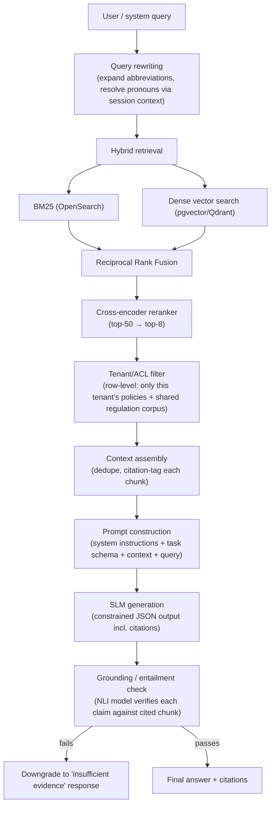

# 7. SLM + RAG Architecture

This is the technical core of Aegis's differentiation: a **proprietary, fine-tuned Small Language Model** running entirely inside the tenant's security boundary, grounded by **Retrieval-Augmented Generation** over the tenant's own policies plus a shared, curated regulatory corpus.

## 7.1 Why a Small Language Model, not a frontier LLM API

| Concern | Frontier LLM API | Proprietary SLM (in-VPC) |
|---|---|---|
| Data residency / PII exposure | Customer PII must leave the tenant boundary unless heavily redacted | Never leaves the VPC — the deciding factor for bank/insurer procurement |
| Cost at scale | $3–15 / 1M tokens; compliance workloads are high-volume (every document, every transaction alert) | Self-hosted 7–8B model: ~$0.05–0.15 / 1M tokens equivalent on owned GPU capacity |
| Latency | Network round-trip + provider queueing, variable | Co-located inference, predictable p95 |
| Domain specialization | General-purpose; hallucinates on jurisdiction-specific clause numbers, thresholds | Fine-tuned on the exact regulatory corpus and historical human decisions the tenant cares about |
| Vendor/model lock-in & availability risk | Provider deprecation, rate limits, policy changes outside your control | Own the weights; full control of upgrade cadence |
| Auditability of decision logic | Opaque, third-party model card, no visibility into training data | Full lineage: base model → fine-tune dataset → eval scores → deployed checkpoint, all logged |

A frontier LLM Gateway remains available as an **opt-in, tenant-configurable fallback** for non-sensitive, general tasks (e.g., drafting a generic internal memo) — never for PII-bearing or regulatory-decision paths.

## 7.2 Base model & fine-tuning strategy

- **Base model**: start from an open-weight 7–8B instruction-tuned model (candidates and rationale in [§12](12-open-source-slm-models.md)) — large enough for strong reasoning over dense regulatory text, small enough to serve cheaply and to fully fine-tune/quantize for single-GPU or even CPU deployment for smaller silo tenants.
- **Domain adaptation, two stages**:
  1. **Continued pre-training** (optional, for the shared base checkpoint) on a curated corpus of public regulatory text (RBI/SEBI/IRDAI circulars, FATF recommendations, Basel framework, FCA handbook, FinCEN guidance, GDPR) to build broad regulatory-domain fluency before any tenant-specific tuning.
  2. **Instruction / preference fine-tuning** using **LoRA/QLoRA** adapters (rank 16–64) trained on:
     - Synthetic + human-curated instruction pairs for each task type (KYC risk rationale, gap-analysis explanation, audit Q&A, summarization).
     - **DPO (Direct Preference Optimization)** using the `approvals` table's approve/reject/modify signal as preference pairs — the model directly learns "what a real compliance officer accepted vs. edited," which is the highest-signal training data the company owns.
- **Per-jurisdiction adapters**: rather than one monolithic fine-tune, maintain swappable LoRA adapters per jurisdiction/regulator (RBI-adapter, SEBI-adapter, FCA-adapter, IRDAI-adapter) loaded on top of the shared base at inference time based on tenant configuration — this keeps fine-tuning cycles cheap and isolated (a new RBI circular doesn't require retraining the SEBI adapter).
- **Per-tenant adapters** (enterprise tier): an additional thin LoRA layer trained on the tenant's own historical approval decisions and house-style policy language, refreshed on a rolling schedule (e.g., monthly) from the feedback loop in [AI Pipeline §3.13](03-ai-pipeline.md).
- **Promotion gate**: every candidate checkpoint is scored against a held-out **regulatory QA benchmark** (curated Q&A pairs with known-correct citations) plus **RAGAS** metrics (faithfulness, answer relevance, context precision/recall). A checkpoint is only promoted to production if it beats the current production model on faithfulness and does not regress on any jurisdiction's benchmark subset — no silent auto-promotion.

## 7.3 RAG pipeline

### Retrieval details
- **Chunking**: clause-aware (see [AI Pipeline §3.6](03-ai-pipeline.md)) — critical because compliance answers must cite a specific clause, not an arbitrary 400-token window that happens to span two unrelated sections.
- **Hybrid search**: dense vector search alone under-performs on exact regulatory terminology and clause-number lookups ("Section 4.2(b)"); BM25 recovers exact-match cases dense embeddings miss. Reciprocal Rank Fusion combines both result sets before reranking.
- **Reranking**: a cross-encoder (e.g., `bge-reranker-large`) re-scores the top-50 candidates for genuine relevance to the query, cutting to the top 6–8 chunks that go into the prompt — keeps context windows small (cheaper, faster, less distraction for the SLM) while improving precision over vector-similarity ranking alone.
- **Multi-corpus retrieval**: every query searches two logically separate indices — the tenant's private policy corpus (RLS-isolated) and the shared, centrally-curated regulation corpus (read-only, updated by the Regulatory Change Monitor) — and tags each returned chunk with its source so the UI can visually distinguish "your policy says" from "the regulation says."

### Generation & grounding
- The SLM is prompted with a strict output schema (JSON: `decision/answer`, `confidence`, `citations[]`) enforced via constrained decoding (grammar-based, e.g. `outlines` or vLLM's structured output support) — eliminates a whole class of malformed-output failures.
- **Grounding check**: a lightweight NLI (natural language inference) model checks each generated claim against its cited source chunk for entailment. Claims that don't entail from any cited chunk are stripped before the response reaches the user, and if this drops the answer below a usable threshold, the system returns "insufficient evidence in the available corpus" rather than a partially-fabricated answer.
- **No orphan claims**: the API contract disallows shipping any sentence in a `recommendation.rationale` field that isn't backed by at least one `citations[]` entry — enforced at the guardrails layer, not just by prompting.

## 7.4 Agentic layer (audit assistant, gap analysis)

Built on the same SLM + RAG substrate, with a constrained tool-use loop (not open-ended agentic autonomy — every tool call is from a fixed, audited allowlist):

- **Audit assistant**: multi-turn session where an auditor asks free-form questions ("show me evidence we screened all high-risk customers for adverse media in Q2"); the agent plans a small sequence of retrieval + structured-query tool calls (`search_policies`, `query_kyc_cases`, `query_screening_results`), assembles a cited answer, and — for anything beyond simple retrieval — proposes an evidence package for the auditor to review rather than asserting a compliance conclusion itself.
- **Gap analysis agent**: given a policy version and a regulation, iterates clause-by-clause: retrieves the best-matching policy clause for each regulation clause, computes a semantic + entailment-based coverage judgment (`covered` / `partial` / `missing` / `outdated`), and writes results to `gap_analyses` for human review — never auto-marks a gap "resolved."

## 7.5 Evaluation & monitoring

- **Offline**: RAGAS (faithfulness, context precision/recall, answer relevance) plus a hand-curated, jurisdiction-tagged regulatory QA benchmark, run on every candidate model/adapter before promotion.
- **Online**: track human agreement rate (`approvals.decision == recommendation` rate) per task type and per jurisdiction adapter as the primary production quality signal; a sustained drop triggers an alert and blocks further auto-apply of low-risk tasks until investigated.
- **Drift monitoring**: embedding-space drift detection on incoming documents vs. the fine-tuning distribution, to catch e.g. a new regulator format the model wasn't trained on.

## 7.6 Serving

- **vLLM** with continuous batching and PagedAttention for the SLM, quantized (AWQ/GPTQ, INT4/INT8) for cost-efficient GPU utilization; LoRA adapters hot-swapped per request via vLLM's multi-LoRA serving so one base-model deployment serves all jurisdiction/tenant adapters without duplicating GPU memory per variant.
- **Autoscaling**: GPU node pool autoscaled (Karpenter) on queue depth, not just CPU/memory, since inference is the bottleneck resource; CPU-only paths (embedding for smaller models, reranking) scaled independently.
