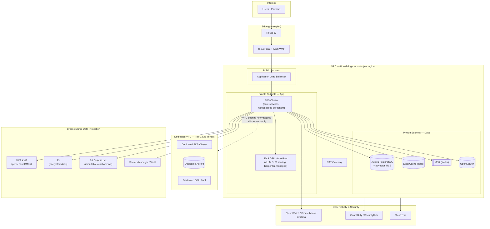
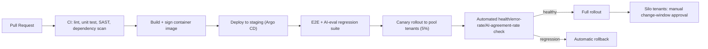

# 8. Deployment Architecture

Primary reference deployment is **AWS**; GCP and Azure equivalents are noted per component since several enterprise prospects mandate a specific cloud (e.g., existing Azure EA, or GCP for a specific regional bank).

## 8.1 AWS reference architecture

## 8.2 Isolation model mapping

| Tenant tier | Compute | Database | GPU inference | Network |
|---|---|---|---|---|
| Pool | Shared EKS namespace per tenant, K8s NetworkPolicy isolation | Shared Aurora cluster, RLS row isolation | Shared GPU pool, multi-LoRA serving (per-tenant adapter, shared base weights) | Shared VPC |
| Bridge | Shared EKS, dedicated namespace + resource quotas | Shared cluster, schema-per-tenant | Shared GPU pool, dedicated adapter | Shared VPC, dedicated security groups |
| Silo | Dedicated EKS cluster | Dedicated Aurora/RDS instance | Dedicated GPU node pool (can be entirely on-prem/tenant-owned VPC via PrivateLink) | Dedicated VPC, optional customer-managed VPC peering |

## 8.3 Multi-region & data residency

- Each tenant's `region` (see `tenants.region` in the [schema](02-database-schema.md)) pins their data plane to a specific AWS region (e.g., `ap-south-1` for Indian banks under RBI data-localization rules, `eu-central-1` for EU insurers under GDPR).
- The regulation corpus (shared, non-tenant-specific) is replicated read-only to every region; tenant policy/customer data never crosses region boundaries.
- Control plane (billing, tenant provisioning, model registry metadata) is centralized in one region but stores no tenant PII.

## 8.4 Disaster recovery

- **RPO**: ≤ 5 minutes (Aurora continuous backup + cross-region snapshot replication for pool/bridge; tenant-configurable for silo).
- **RTO**: ≤ 1 hour for pool/bridge (warm standby in a secondary AZ, automated Aurora failover); silo tenants can contract a dedicated RTO/DR tier including a warm standby in a second region.
- Kafka topics replicated across AZs (MSK multi-AZ); event replay capability doubles as both DR recovery and AML backtesting infrastructure.
- Quarterly DR game-days, results logged as SOC 2 control evidence (see [Security §11](11-security-compliance.md)).

## 8.5 CI/CD & release flow

Model checkpoints follow a parallel, stricter gate: promotion requires passing the offline eval suite ([§7.5](07-slm-rag-architecture.md)) *and* a canary period where the new checkpoint's outputs are logged and shadow-compared against the current production model before it's allowed to affect real user-facing recommendations.

## 8.6 GCP / Azure equivalents

| AWS | GCP equivalent | Azure equivalent |
|---|---|---|
| EKS | GKE | AKS |
| Aurora PostgreSQL | Cloud SQL for PostgreSQL / AlloyDB | Azure Database for PostgreSQL |
| S3 (+ Object Lock) | Cloud Storage (+ Bucket Lock) | Blob Storage (+ Immutable Storage) |
| KMS | Cloud KMS | Key Vault |
| MSK | Confluent Cloud / Pub/Sub | Event Hubs |
| CloudFront + WAF | Cloud CDN + Cloud Armor | Front Door + WAF |
| GuardDuty/SecurityHub | Security Command Center | Microsoft Defender for Cloud |
| GPU node pools | GKE GPU node pools (A2/G2) | AKS GPU node pools (NC/ND series) |

Azure is typically the path of least resistance for enterprise banks already on Microsoft EA with Azure AD/Entra ID SSO requirements; GCP is favored where a prospect already runs BigQuery-centric data infrastructure.
