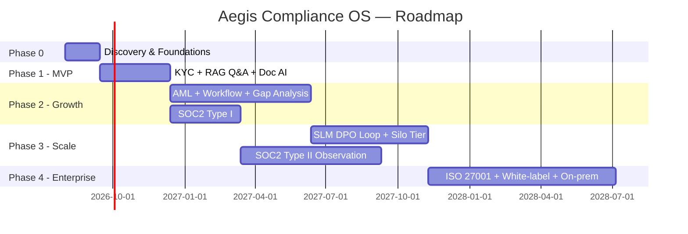

# 9. Development Roadmap — MVP → Enterprise

## Phase 0 — Discovery & foundations (Weeks 1–6)
- Design partner interviews (2–3 NBFCs/FinTechs, 1 mid-size bank) to validate the KYC/AML workflow and required regulator coverage.
- Stand up core infra skeleton: multi-tenant Postgres + RLS, auth/SSO, API gateway, base Kubernetes cluster, CI/CD.
- Seed the regulation corpus for one jurisdiction (e.g., India — RBI/SEBI) as the launch market.
- Select and stand up the base open-weight SLM (see [§12](12-open-source-slm-models.md)) with baseline (non-fine-tuned) RAG over the seeded corpus.

**Exit criteria**: a design partner can log in, upload a policy document, and get a grounded, cited answer to a compliance question.

## Phase 1 — MVP (Months 2–4)
Scope: **one jurisdiction, pool-tier multi-tenancy only, single design-partner-driven vertical (start with NBFC lending)**.
- KYC case management: customer onboarding, document upload, OCR + classification + extraction, sanctions/PEP screening integration (one vendor), AI risk recommendation with mandatory human approval.
- Document classification & summarization for policies and regulatory circulars.
- RAG-based compliance Q&A ("audit assistant" v0 — single-turn, no agentic tool use yet).
- Basic policy repository with versioning.
- Immutable audit log (hash-chained, not yet WORM-archived).
- Manual regulatory change ingestion (no automated crawler yet).
- Web app only (no mobile).

**Team**: ~8 (2 backend, 2 AI/ML, 2 frontend, 1 DevOps/infra, 1 product/compliance SME).
**Exit criteria**: 2–3 paying design-partner tenants running live KYC cases through the platform; SLM fine-tune v1 shipped and beating baseline on the internal QA benchmark.

## Phase 2 — Growth (Months 5–10)
- AML transaction monitoring: rule engine + ML risk scoring, alert case management, SAR workflow (human-filed, AI-drafted).
- Full workflow & approval engine (Temporal-backed), configurable per tenant.
- Policy comparison & gap analysis (automated clause-level mapping + human review queue).
- Regulatory change monitoring: automated crawler/feed ingestion for RBI/SEBI (+ start FCA/MAS for a second jurisdiction), auto-diff and gap-analysis trigger.
- Multi-tenant hardening: bridge tier (schema-per-tenant), per-jurisdiction LoRA adapters.
- Mobile app for field KYC agents.
- SOC 2 Type I readiness work begins (control implementation).

**Team**: ~18 (add AML/risk engineers, a second AI/ML pair for the fine-tuning pipeline, security engineer, 2nd product manager, compliance content team for regulation corpus curation).
**Exit criteria**: AML alert triage in production for at least one bank/NBFC tenant; SOC 2 Type I report issued.

## Phase 3 — Scale (Months 11–16)
- Proprietary SLM: DPO fine-tuning loop live off real approval/rejection feedback; per-tenant adapters (enterprise add-on).
- AI audit assistant becomes agentic (multi-turn, constrained tool-use over case/policy/screening data).
- Silo deployment tier for tier-1 banks/insurers (dedicated VPC, dedicated GPU pool).
- Expand jurisdiction coverage to 4–5 (add IRDAI for insurance vertical, FinCEN/OFAC depth for US FinTechs, GDPR/EU AML directives).
- Data warehouse + regulator reporting extracts (BI layer).
- SOC 2 Type II (6-month observation window starts).

**Team**: ~35 (regional compliance SMEs per new jurisdiction, SRE team for silo tenant ops, enterprise sales engineering).
**Exit criteria**: first tier-1 bank live on a silo deployment; multi-jurisdiction gap analysis in production.

## Phase 4 — Enterprise (Months 17–24)
- ISO 27001 certification.
- SOC 2 Type II report issued.
- Insurance-specific modules (claims-fraud AI screening, IRDAI conduct-of-business monitoring).
- White-label / embedded option for core-banking vendors to resell.
- Advanced agentic automation: end-to-end remediation drafting (AI drafts the policy update in response to a detected gap, routed through full approval workflow — never auto-published).
- On-prem / customer-VPC deployment option for the most restrictive tier-1 mandates.
- Model governance program: bias/fairness audits on AI risk-scoring, published model cards per jurisdiction adapter, third-party AI model audit.

**Team**: ~70+ across engineering, compliance content, and regional GTM.
**Exit criteria**: SOC 2 Type II + ISO 27001 both current; ≥3 tier-1 bank/insurer logos live; platform handling all core compliance workflows (KYC, AML, risk, policy, audit) for at least one full regulatory cycle (12 months) per marquee customer.

## 9.1 Roadmap at a glance

